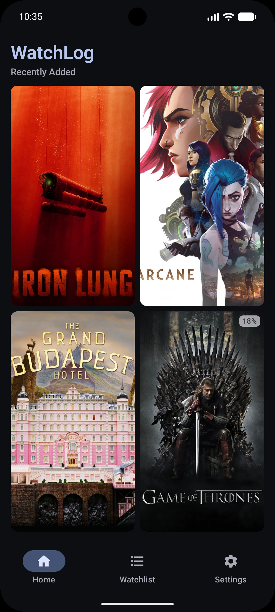
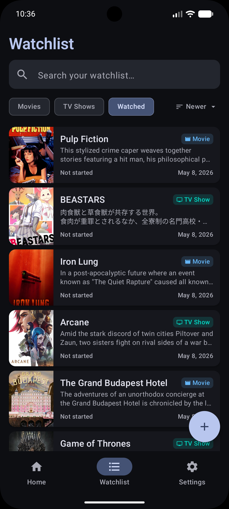
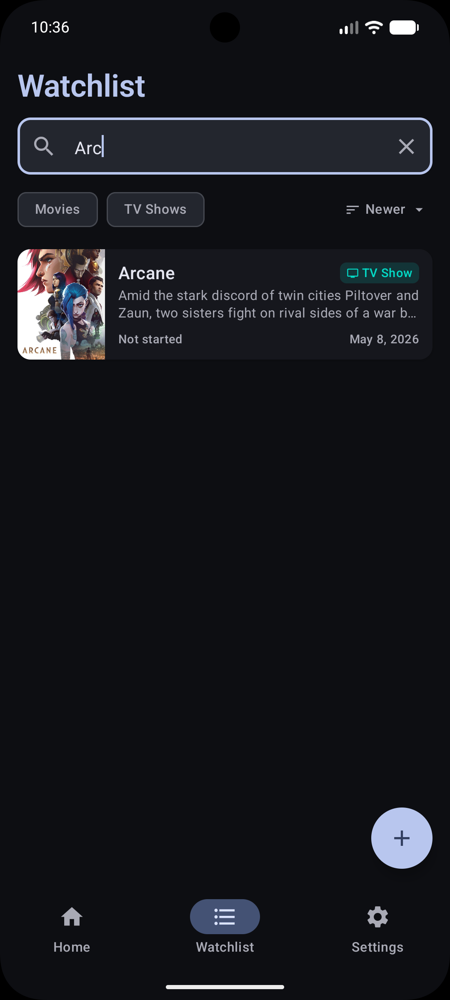
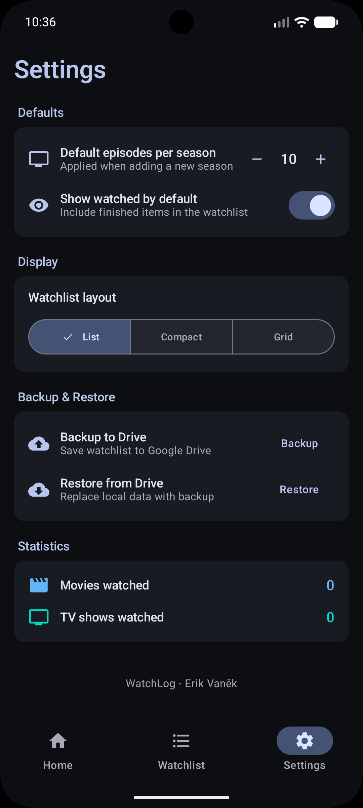
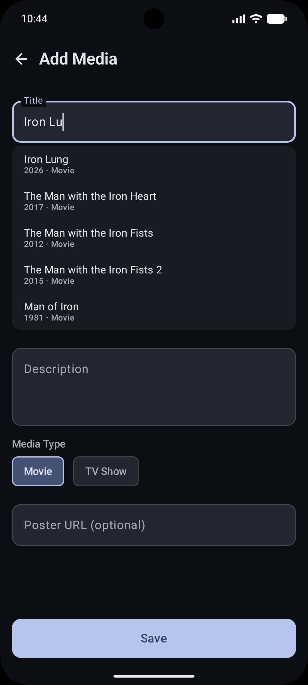
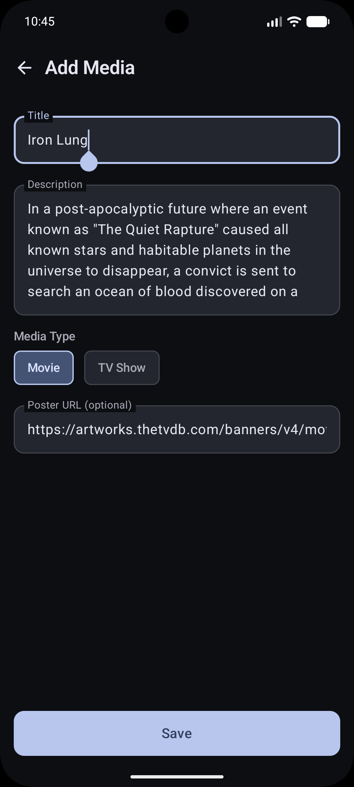
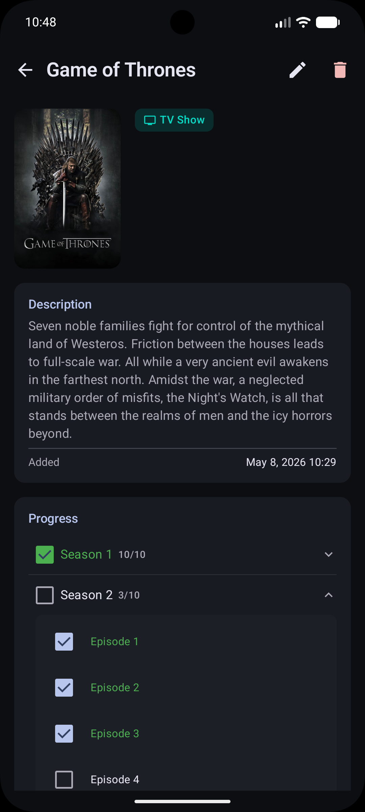
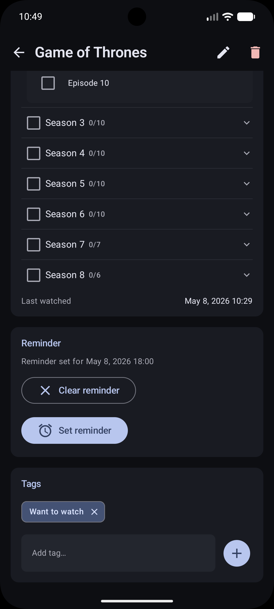

# Watchlog
Simple, fast watch tracker for movies and TV shows. 🎬

## ✨ Overview 
Watchlog is a free clean add-free app for tracking what you have watched, are watching, or want to watch. It focuses on speed and minimal friction: search by title, pick a result from autocomplete, and keep your progress updated without social clutter.

## 🔧 Features
- Fast search with autocomplete backed by **TVDB v4 API**
- Manual add/edit for missing titles
- Progress tracking for movies and TV shows (season/episode)
- Automatic timestamps for added and last-watched dates
- Optional tags for organizing your list
- Local-first storage with real-time UI updates
- Google Drive backup and restore
- Reminder notifications for scheduled watch times

📸 Screenshots

<table>
  <tr>
    <td align="center">
      <strong>Home</strong> 
      
    </td>
    <td align="center">
      <strong>Watchlist</strong> 
      
    </td>
    <td align="center">
      <strong>Search</strong> 
      
    </td>
    <td align="center">
      <strong>Settings</strong> 
      
    </td>
  </tr>
  <tr>
    <td align="center">
      <strong>Add (Whisper)</strong> 
      
    </td>
    <td align="center">
      <strong>Add (Autofill)</strong> 
      
    </td>
    <td align="center">
      <strong>Details</strong> 
      
    </td>
    <td align="center">
      <strong>Reminders & Tags</strong> 
      
    </td>
  </tr>
</table>

## 📦 Releases 
- [Releases](../../releases)

## 🤝 Contributing / Own compilation
Issues and pull requests are welcome.

If building your own APKs, remember to add your API_KEY to local.properties as `TVDB_API_KEY={your api key}`, without it the whisper/autocomplete feature won't work. 
_The released apk builds already contain my API_KEY._

## 🧾 License
Free to use for personal and non-commercial purposes. Commercial redistribution is not permitted. Forks are welcome if they include significant changes and clearly note the original source.
